# Music business landscape analysis
## Selma Laarabi

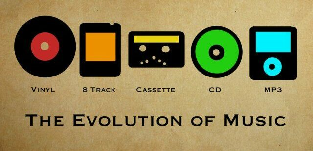


## Introduction
Music is the common language of the world, and just like any other form of communication it evolves alongside our needs.
In this project we are going on a journey to explore how our listening habit evolved overtime, and how much of a market music represents.
For this project, I had to collect data from multiple sources:     
   * The kaggle data repository    
   * Web scraping from different websites   
   * Public APIs   
   * Different articles on the internet 
### From Kaggle : 
  The data set contained list of release since 1950, per genre and per country, and physical format, this data set needed cleaning and normalization when it comes to different formats types, in addition to aggregations by format and by country.
### Web scraping :
  Using the library Beautiful soup, I scraped a table from a Wikipedia page (https://en.wikipedia.org/wiki/Vinyl_revival) about the popularity of vinyl in the recent years by region (mostly USA, Japan, Australia..)
  


Example above of the table I got from webscraping, which needed some work where I used the melt function in pandas to get it ready for visualization and loading into CSV.

  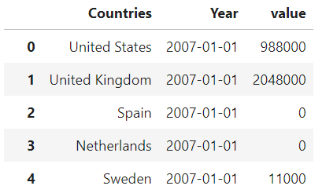

  
  
### Public Apis:
  I used Api queries from the website LastFm, to get data about the most played artists in the streaming services, and another API call to get the top genres.

           r = requests.get('https://ws.audioscrobbler.com/2.0/', headers=headers, params=payload)


Json response example:
  
  ```
  {
    "artists": {
        "@attr": {
            "page": "1",
            "perPage": "50",
            "total": "4346864",
            "totalPages": "86938"
        },
        "artist": [
            {
                "image": [
                    {
                        "#text": "https://lastfm.freetls.fastly.net/i/u/34s/2a96cbd8b46e442fc41c2b86b821562f.png",
                        "size": "small"
                    },
                    {
                        "#text": "https://lastfm.freetls.fastly.net/i/u/64s/2a96cbd8b46e442fc41c2b86b821562f.png",
                        "size": "medium"
                    },
                    {
                        "#text": "https://lastfm.freetls.fastly.net/i/u/174s/2a96cbd8b46e442fc41c2b86b821562f.png",
                        "size": "large"
                    },
                    {
                        "#text": "https://lastfm.freetls.fastly.net/i/u/300x300/2a96cbd8b46e442fc41c2b86b821562f.png",
                        "size": "extralarge"
                    },
                    {
                        "#text": "https://lastfm.freetls.fastly.net/i/u/300x300/2a96cbd8b46e442fc41c2b86b821562f.png",
                        "size": "mega"
                    }
                ],
                "listeners": "3632229",
                "mbid": "20244d07-534f-4eff-b4d4-930878889970",
                "name": "Taylor Swift",
                "playcount": "1024216535",
                "streamable": "0",
                "url": "https://www.last.fm/music/Taylor+Swift"
            }
  ```
  
 
### Articles on the internet:
I used mostly Medium for general knowledge, and specifically the website RIAA (The Recording Industry Association of America which is a trade organization that represents the music recording industry in the United States) 
 
After extracting this raw data, I have used Jupyter notebooks to process it, transform it and make it ready for loading and analysis.
I have stored my processed data into a Mysql database and various CSV files and for visualisation I have used Tableau.

## Music physical format releases

Physical formats have been around since the 1870s—ever since, As the world evolves (and so have we) we’ve came up with different ways to listen to music.   
For 80 years, Vinyl, also known as LP or SP, was the format of choice to enjoy our music, however by the early 90’s CDs already started to dominate the share of preferred formats, with 41% releases out of all records released in 1991 and continued to dominate until the late 2010’s with the sudden surge of vinyl.   
So, Is it safe to say that we are living a vinyl revival era?

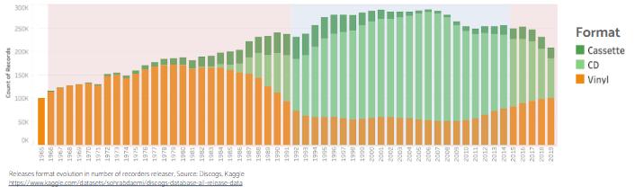


## Recent vinyl (r)evolution

Following a continues decline in sales, in  2006, Vinyl sales revenues have been on a dramatic increase achieving an incredible growth of 1123% in just 10 years.
But does it mean that most albums sold are in vinyl format ? Can we see the same growth in the overall sales of music albums?   
This graph represents the Global vinyl sales in Billions of dollars.

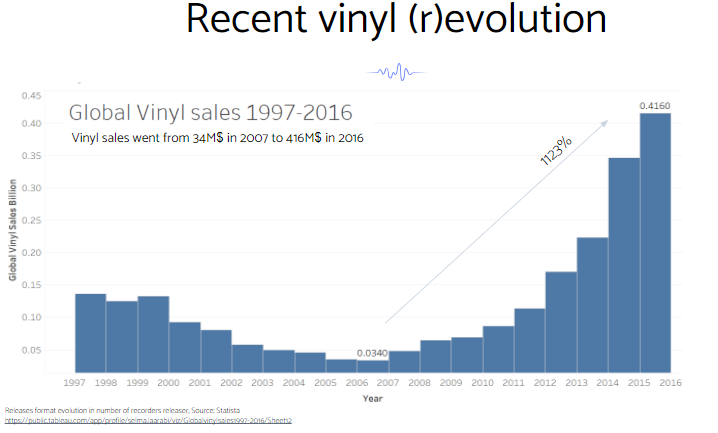    

## Global album sales vs LP(vinyl) share
We can clearly see that the overall album sales are dropping drastically, however we notice that vinyl is taking more and more shares of the sold albums.
Even though vinyl is gaining a lot of popularity recently, this data shows that we don’t consume music as much we did before, to verify this, Let’s look at the evolution of global revenues of the music business.

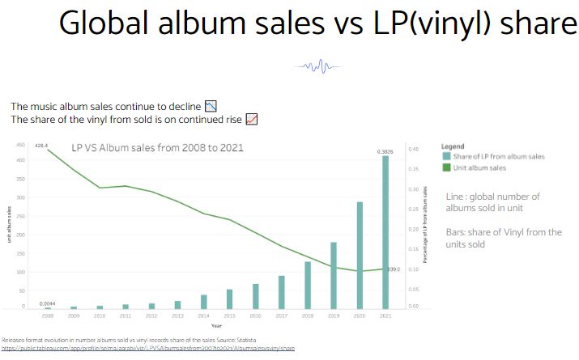

This graph shows the number of  units sold and the share of vinyl from these sales


## Global music revenues
Ever since the 2000’s it’s been in a constant decline, However we can see a noticeable increase in the recent years.  
What exactly happened between 2002 and 2010 to cause this decline?
What is contributing to this recent big increase?

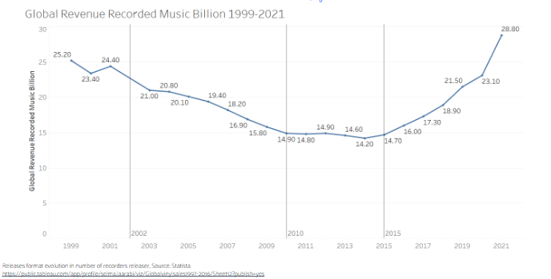


Next we’re going to see a year on year representation of the music revenues.

## Breaking down revienues over the years
  * The P2P days:

P2P stands for peer to peer, it is a file sharing protocol that allows people to share documents (or music files) for free, it first appeared in the late 90’s.
Napster was a pioneer of digital audio files distribution, where audio songs were typically encoded in the MP3 format and easily shared across the internet.
The popularity of Napser and other P2P software, had such an impact on music industry that In 2000, Metallica sued  Napster for copyright violation,
The file sharing software company lost the case and filed for bankruptcy in 2002.

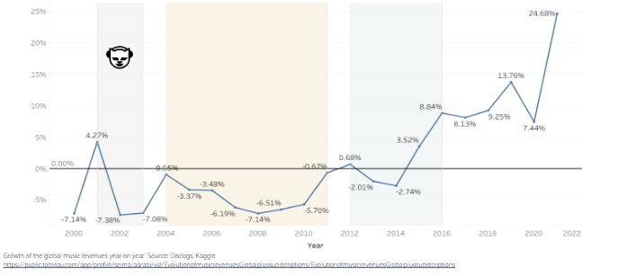
However, the decline continues.  

  * The torrent crisis:  

Bittorrent, or simply known as torrent, was also a P2P file sharing protocol, it operated differently that the previous file sharing software and was trickier to combat due to its ways of working.
In 2003 Pirate Bay was launched, It was a popular torrent index to search and download media files for free, it was so popular that it deeply impacted the music revenues for the next 10 years.

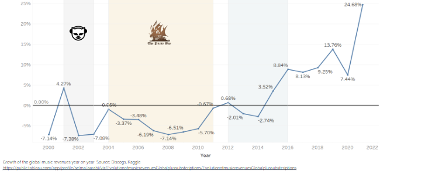

 Which we can clearly see on the graph above.
 
  * Post piratebay

In 2009 The Pirate Bay was sued, and it was shutdown a couple of years later.  
Due to heavy regulations regarding the illegal downloads, and the various lawsuits, Torrenting fell in popularity but it did not result in a direct recovery of the music revenues 
We would assume that a decade of owning music for free, would change people’s listening habit. 

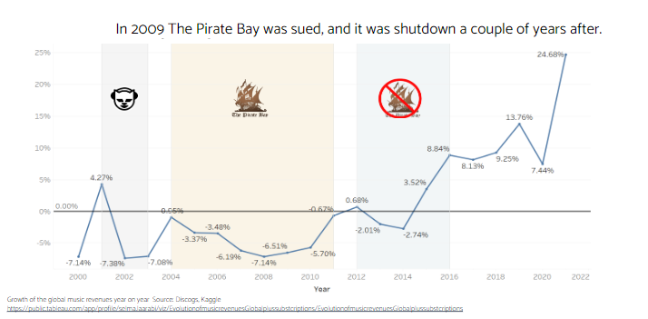

However, starting from 2015 things started to change.

## The new kid on the block : Streaming services
By the mid 2000s, streaming services started to make an appearance, with spotify being the most famous platform, their continued rise in popularity in the mid 2010’s contributed greatly to the recovery of the global revenues (with a 94% increase in global music revenues from 2011-2021).  

  * But how much does this represent from the overall music revenues ?
In the second chart, we can see the evolution of both the streaming revenues as we as the global revenues without the subscription contribution.
between 2011 and 2021, the global music revenues (minus the streaming services) continued to decline, with a 16% overall decrease. While the subscription revenues continued rise.

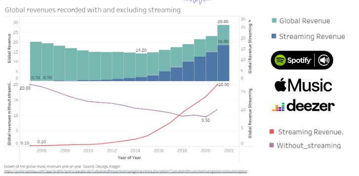

Now that we have a clearer idea about who makes the most profits, where does vinyl fit in all of this ?

## Is vinyl making a difference ?
Since our global vinyl sales data is limited, let’s look at the US as an example for the growth of the music revenues  from 2011 to 2021.  
The overall music revenues in the US increased by 75% (94% Globally), we can safely assume that this growth is aligned with the global trend, then we can project the growth of the vinyl market in the us to the global market.

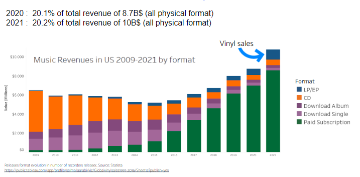

In the US we can see that The vinyl market share has gone from 2%  in 2011 up to 9,7% in 2021 from the global revenues.

## Streaming service share
If we look at the the year 2020,  we see that from 8.7B $ revenue, streaming services revenue represented 79.9% of the total market revenue
For the year 2021 79.8% of total revenue of 10B$.  

So it’s safe to say that Physical media especially vinyl and paid subscriptions are growing together in a market that it’s expanding. 

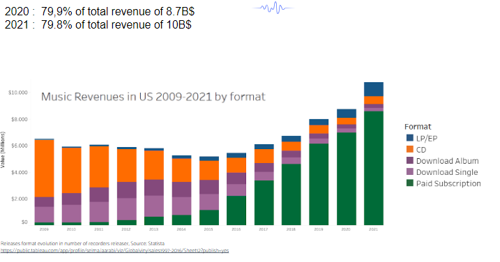


## Music genres per medium
Now let’s see what people listen to:
  * We can see that rock bands are the most common genre on Vinyl.

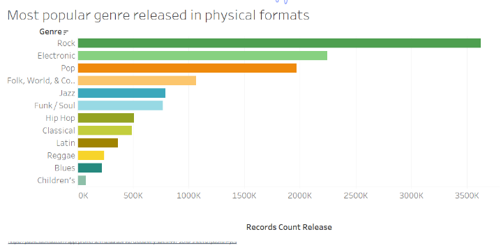

Vinyl (Still) Rocks \m/

  * While in streaming services it’s pop 
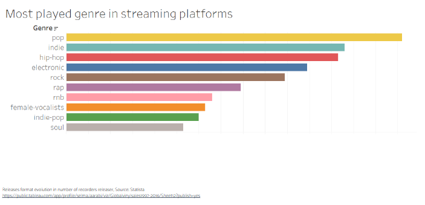

We can see the different listening behavior(habits) between the 2 mediums

## Conclusion

  * Music formats evolved over time. In the 2000’s, this evolution started to threaten the music industry through piracy.
  * Vinyl might have came back as a niche in the recent years, but it is becoming more significant in the revenues it generates.
  * Though lot of formats came and went throughout the years, Vinyl has always been present.
  * As technology allowed us to access music more easily (and for free) the music industry suffered for a long period from piracy, until music streaming made an appearance.
  * In an era when so much music became available for less than 10 euros/month, people still want to access their favorite songs by owning a physical copy alongside a streaming subscription, and Vinyl still found a place in the recent years
  
*       sometimes Discovering an artist on Spotify can lead to a vinyl purchase.


